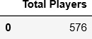
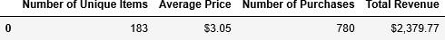
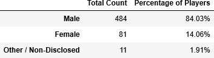
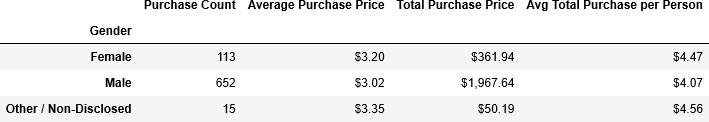
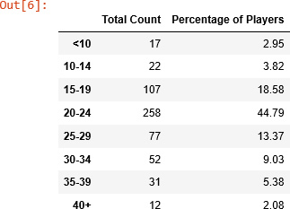
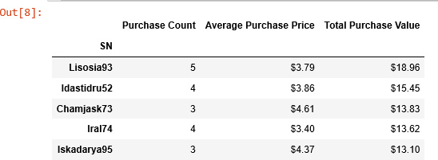
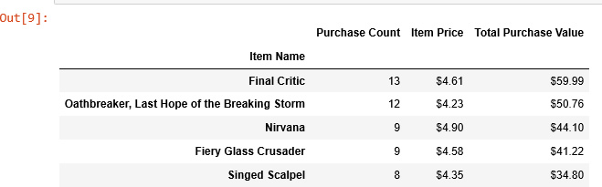
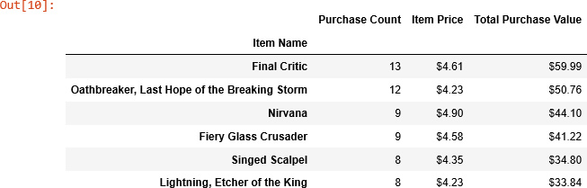

Data Analytics - Boot Camp - Homework #4 - Heroes of Pymoli | Data Analysis
# Unit 4 | Assignment - Heroes of Pymoli | Data Analysis

## Data Analysis Includes:

### Player Count

- - -

### Purchasing Analysis (Total)

- - -

### Gender Demographics

- - -

### Purchasing Analysis (Gender)

- - -

### Age Demographics

- - -

### Purchasing Analysis (Age)

- - -

### Top Spenders

- - -

### Most Popular Items

- - -

## Submission

* Submitted to GitHub:

  * Microsoft Word Document Heroes of Pymoli-Analysis.docx with clean DataFrame screenshot results.
  * Pandas Cell Code - heroes_of_pymoli_code.txt as separate file.
  * HeroesOfPymoli.ipynb to show all of the code with poor table displays.

https://github.com/BrianLabelle/pandas-heroes-of-pymoli

- - -

© 2019 Rice Cookers | Brian Labelle | Sous-Coding Chef

- - -

## Noteworthy Errors Encountered:
 - A value is trying to be set on a copy of a slice from a DataFrame
 - ValueError: operands could not be broadcast together with shapes (179,) (0,) 
 - IndexError: single positional indexer is out-of-bounds
 - ValueError: Invalid call for scalar access (getting)!
 - ValueError: The truth value of an array with more than one element is ambiguous. Use a.any() or a.all()
 - Exception: Column(s) Price already selected
 - AttributeError: 'SeriesGroupBy' object has no attribute 'value'
 - ValueError: operands could not be broadcast together with shapes (179,) (145,)

- - -

# References:
## General
##### https://pandas.pydata.org/pandas-docs/stable/index.html
##### https://www.linkedin.com/learning/pandas-essential-training/groupby-computations
##### https://www.geeksforgeeks.org/create-a-pandas-dataframe-from-lists/
##### https://stackoverflow.com/questions/20937538/how-to-display-pandas-dataframe-of-floats-using-a-format-string-for-columns
##### https://www.geeksforgeeks.org/how-to-get-column-names-in-pandas-dataframe/
##### https://www.geeksforgeeks.org/python-pandas-dataframe-drop_duplicates/
##### https://www.geeksforgeeks.org/adding-new-column-to-existing-dataframe-in-pandas/
##### https://stackoverflow.com/questions/19851005/rename-pandas-dataframe-index
##### https://www.geeksforgeeks.org/python-extracting-rows-using-pandas-iloc/
##### https://stackoverflow.com/questions/14529838/apply-multiple-functions-to-multiple-groupby-columns

## 5. Purchasing Analysis ( Gender )
##### https://www.linkedin.com/learning/pandas-essential-training/groupby-computations
##### https://www.geeksforgeeks.org/create-a-pandas-dataframe-from-lists/
##### https://stackoverflow.com/questions/20937538/how-to-display-pandas-dataframe-of-floats-using-a-format-string-for-columns
##### https://www.geeksforgeeks.org/how-to-get-column-names-in-pandas-dataframe/
##### https://www.geeksforgeeks.org/python-pandas-dataframe-drop_duplicates/
##### https://www.geeksforgeeks.org/adding-new-column-to-existing-dataframe-in-pandas/
##### https://stackoverflow.com/questions/19851005/rename-pandas-dataframe-index
##### https://www.geeksforgeeks.org/python-extracting-rows-using-pandas-iloc/
##### https://stackoverflow.com/questions/14529838/apply-multiple-functions-to-multiple-groupby-columns

## 6. Age Demographics
##### https://pandas.pydata.org/pandas-docs/version/0.23.4/generated/pandas.cut.html
##### http://localhost:8888/notebooks/000-Pandas/3/Activities/03-Ins_Binning/Solved/Binning.ipynb
##### https://chrisalbon.com/python/data_wrangling/pandas_delete_duplicates/
##### https://stackoverflow.com/questions/34317149/pandas-groupby-with-bin-counts
##### https://www.reddit.com/r/learnpython/comments/73z4e2/pandas_groupby_or_cut_dataframe_to_bins/
##### https://stackoverflow.com/questions/45389126/sort-index-by-list-python-pandas

## 8. Top Spenders
##### https://pandas.pydata.org/pandas-docs/version/0.19/generated/pandas.DataFrame.sort.html
##### https://stackoverflow.com/questions/17839973/constructing-pandas-dataframe-from-values-in-variables-gives-valueerror-if-usi

## 9. Most Popular Items
##### https://www.geeksforgeeks.org/python-pandas-dataframe-get_value/
##### https://appdividend.com/2019/01/26/pandas-set-index-example-python-set_index-tutorial/
##### https://www.geeksforgeeks.org/python-pandas-dataframe-loc/
##### https://pandas.pydata.org/pandas-docs/stable/reference/api/pandas.DataFrame.at.html#pandas.DataFrame.at

